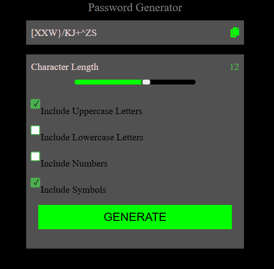

# 🔐 Password Generator

A responsive and customizable password generator built with HTML, SCSS, and JavaScript. It allows users to generate secure passwords based on selected criteria and provides a visual strength indicator.

## 🚀 Live Demo

👉 [View Live on GitHub Pages](https://eddieramirez29.github.io/Password-generator)

## ✨ Features

- Generate strong and random passwords
- Select password length
- Toggle character options:
  - Uppercase letters
  - Lowercase letters
  - Numbers
  - Symbols
- Copy to clipboard with a single click
- Password strength meter (Weak, Medium, Strong)
- Responsive and clean UI

## 🖼️ Preview

 <!-- Replace or remove if not available -->

## 📦 Technologies Used

- HTML
- SCSS
- JavaScript (ES6)

## ⚙️ How It Works

1. Adjust the desired password length using the slider.
2. Select which character types you want to include.
3. Click the **Generate Password** button.
4. Use the **Copy** button to copy the password to the clipboard.
5. The strength meter will give you feedback based on your settings.

